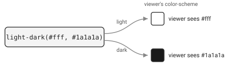

import Metro from "@components/Metro.astro";
import { Aside } from "@astrojs/starlight/components";

An nf-metro SVG has no separate light and dark version, and nf-metro never
re-renders it when the viewer's theme changes. Every themeable color is baked
in as a pair, and native CSS picks the right half at display time:



<Aside type="note" title="The recipe, if you just want it">

1. Use `light-dark(light, dark)` for every theme-dependent color.
2. Set `color-scheme: light dark` on the root - required for `light-dark()`
   to resolve at all.
3. Embedding in a page with its own toggle? Drop that `color-scheme` so the
   SVG inherits the page's instead.
4. Need host CSS variables too, not just the toggle? Inline the SVG rather
   than referencing it by URL.

The rest of this page is the reasoning and the exceptions.

</Aside>

## `light-dark()` and `color-scheme`

`light-dark()` takes two color values and resolves to one of them. It works
on any color property, so it drops straight into SVG presentation attributes
and `<style>` rules:

```css
fill: light-dark(#ffffff, #1a1a1a);
```

It resolves against the nearest `color-scheme` in effect - without one,
`light-dark()` values sit in the CSS inert, with nothing to pick a side:

```css
:root {
  color-scheme: light dark;
}
```

`light dark` means "both are supported here - pick whichever the current
preference is." Pinning one side instead (`color-scheme: dark`) forces every
`light-dark()` under it to that value regardless of preference - a
deterministic escape hatch for something like a PNG export.

## `var()` for host overrides (optional)

```css
fill: var(--my-bg, light-dark(#ffffff, #1a1a1a));
```

A page embedding the SVG (the **host page**) can set `--my-bg` on a wrapper to
override the color outright; if it doesn't, the light/dark pair still runs.
This layer is optional - `light-dark()` + `color-scheme` is the whole
mechanism. nf-metro calls the properties it exposes this way (background,
title, labels, section boxes, legend) **chrome** - as opposed to line and
route colors, which carry meaning and stay fixed.

## Where `color-scheme` should live

`color-scheme` is **inherited**: an element with no `color-scheme` of its own
takes its ancestor's computed value, the same as `font-family` or `color`
normally would. But redeclaring it resets what "current preference" means for
everything under it - an element that sets its own `color-scheme` stops
inheriting and starts from scratch. That matters once the SVG is
embedded, because a host page and the SVG can disagree about who owns that
decision. nf-metro has two modes, controlled by `self_color_scheme` on
`render_svg` (`--no-self-color-scheme` on the CLI):

**Standalone (the default).** The root `<svg>` declares its own `color-scheme`
(`src/nf_metro/render/svg.py:2595-2597`):

```html
<svg style="color-scheme: light dark"></svg>
```

so `light-dark()` resolves against **the viewer's OS/browser preference** -
correct for a file opened on its own, or dropped into a page that has no
opinion about theme.

**Embedded in a page that already manages theme.** Passing
`--no-self-color-scheme` (used for every `<Metro>` embed on this docs site -
`website/src/lib/render-metro.mjs:277`) omits that declaration, so the `<svg>`
inherits `color-scheme` from its host instead. This site's theme picker sets
it on `<html>`:

```css
/* reset.css, from Starlight - the framework this docs site is built with */
html {
  color-scheme: dark;
}
html[data-theme="light"] {
  color-scheme: light;
}
```

This map has no `color-scheme` of its own, so it follows _that_ - use the
theme picker in the nav to switch it, independent of your OS setting:

<Metro src="examples/guide/01_minimal.mmd" clean />

The two modes aren't interchangeable: an SVG that declares its own
`color-scheme: light dark` while embedded ignores a host's forced single
value and falls back to the OS preference regardless of what the host's
toggle says - redeclaring `light dark` reopens both options, so the "current
preference" it resolves against reverts to the browser/OS signal rather than
the host's choice. That's why `--no-self-color-scheme` exists: leaving the
property off the SVG root is what lets a host's manual toggle reach it at
all.

`--no-self-color-scheme` alone isn't the whole story: it only decides _whose_
preference wins. Something still has to supply a `light-dark()` pair to
resolve in the first place - that's a separate, independent job, done by the
chrome CSS from the `var()` ingredient above. Both have to be right for an
embedded map to stay theme-adaptive.

<Aside type="tip" title="What this docs site itself passes">

From `renderMetroFile` (`website/src/lib/render-metro.mjs:254-296`):

| Flag                     | `<Metro>` embed | OG image export |
| ------------------------ | --------------- | --------------- |
| `--no-self-color-scheme` | always          | always          |
| `--no-chrome-css`        | never           | always          |

`--no-chrome-css` bakes chrome colors to one concrete value, so if an inline
embed passed it there would be no `light-dark()` pair left for
`--no-self-color-scheme` to matter about. It's reserved for the OG-image
path, which needs one fixed image anyway, not a page-following one.
(`--no-manifest` is also passed to every embed here, but only skips per-node
metadata `<Metro>` doesn't use - it has no effect on theming.)

</Aside>

## The transparent-background fallback

A transparent-background theme has no `--nfm-bg` pair to lean on, so text
drawn straight onto the canvas (titles, section labels) can still turn
illegible against whatever the host page's background is. For that one case,
nf-metro adds a second, coarser path, built on a different feature -
`prefers-color-scheme`, a media query you branch a whole stylesheet rule on,
not a property like `color-scheme` that `light-dark()` resolves per value
(`src/nf_metro/render/svg.py`, `_inject_dark_mode_style`):

```css
@media (prefers-color-scheme: dark) {
  .nf-metro-section-label {
    fill: #d0d0d0;
  }
  .nf-metro-title {
    fill: #ffffff;
  }
}
```

`--no-dark-mode-css` turns it off, for a host whose own theming it would
otherwise fight.

<Aside type="note" title="One theme opts out of all of this on purpose">

nf-metro ships one theme with no light/dark sibling at all - `light`
(`THEME_MODES`, `src/nf_metro/themes/__init__.py`). For it, `mode_pair(theme)`
returns `None`: every `--nfm-*` fallback is a single baked value, no
`light-dark()` anywhere, and `self_color_scheme` has nothing to do (no
`color-scheme` gets declared either way). The media query above is the only
adaptation such a theme gets - reach for it deliberately, not by leaving
`--theme`/`%%metro style:` unset.

</Aside>

## Consumers that can't parse any of this

Some SVG consumers - `cairosvg` among them - parse a restricted CSS subset
and abort outright on `light-dark()` or `var()`. nf-metro's export flags map
directly onto the ingredients above:

```bash
# bake one concrete palette; no var()/light-dark() left to choke on
nf-metro render pipeline.mmd -o pipeline.svg --no-chrome-css --mode light

# pin color-scheme for a consumer that DOES understand light-dark(),
# so the result is deterministic rather than following its own environment
nf-metro render pipeline.mmd -o pipeline.svg --mode dark
```

Full flag reference: [Embedding](/nf-metro/embedding/).

## `` is a special case; `<object>`/`<embed>` are not consistent

"Inline" means the SVG's own markup is pasted directly into the host page, as
opposed to referenced by URL:

```html
<!-- referenced: a separate document -->


<!-- inline: part of this document -->
<svg>
  <rect fill="light-dark(#fff, #1a1a1a)" ... />
</svg>
```

`` loads the SVG into its own document, so ordinary CSS - custom
properties, cascade, inheritance - stops there; `var()` overrides never
arrive. `color-scheme` is the one deliberate exception: per [Media Queries
Level 5](https://www.w3.org/TR/mediaqueries-5/#prefers-color-scheme), an
``-loaded SVG resolves `prefers-color-scheme` and `light-dark()` against
**the used `color-scheme` of the `` element**, not the OS preference -
overriding even the SVG's own `color-scheme: light dark`. Chromium and
Firefox honor this cleanly and deterministically, independent of the OS
preference either way.

Safari does not: it ignores the ``'s declared `color-scheme` entirely
and just follows the real system/browser preference instead, exactly as if
no override were present at all.

Getting to that answer took three attempts, worth recording because each
wrong turn was plausible on its own. Playwright's bundled WebKit gave
inconsistent results across repeated runs (occasionally dark, mostly light,
no clean rule) - not trustworthy on its own. A same-origin `http://` test
against real Safari, with real system Dark Mode toggled by script and the
rendered pixel read back through canvas, gave a clean but different answer:
light regardless of anything, 12/12. That also turned out wrong, confirmed by
manually toggling System Settings by hand and looking: the embedded SVG
tracks the OS setting correctly, it just never sees the ``'s override.
The scripted toggle was changing the real system preference (confirmed with
`defaults read -g AppleInterfaceStyle`, and Safari's own top-level page
tracked it correctly throughout), but apparently didn't fully propagate to a
freshly-launched process's embedded-image rendering path in time - the same
failure mode, it turned out, also silently invalidated an equivalent
scripted check for Firefox before a manual check corrected that one too.
Chrome and Firefox's "the `` wins" results, and Safari's "the OS wins,
the `` is ignored" result, are the ones confirmed by hand, in real
browsers, with a real System Settings toggle - trust these over both the
Playwright numbers and the scripted-toggle numbers above them, and don't
trust a scripted OS-appearance change to notify every app correctly, verify
by hand when a claim matters.

`<object>`/`<embed>` don't get this: they open a full nested browsing context,
which the spec excludes. Chromium and WebKit keep them OS-only in Playwright
testing; Firefox propagates the host's `color-scheme` into them too - not
re-verified by hand the way the `` numbers above were, so given how
often the scripted checks above needed correcting, treat this one as a
starting point rather than a settled result, and don't rely on either
`<object>` or `<embed>` for this regardless.

<Aside type="caution" title="This makes one SVG a reasonable design, not a universal one">

A single correctly-authored SVG genuinely does not need a light/dark pair of
files - but only document it as "follows the _host's_ chosen theme in
Chromium and Firefox; follows the _viewer's OS_ setting in Safari, not the
host's." The Safari gap is a real engine limitation with no authoring fix: no
`.mmd` directive, render flag, or CSS trick on the embedding page changes it.
It also fails safely, not badly - a Safari user still sees a light or dark
map matching their own system, it just won't necessarily match the host
page's theme if the two disagree, rather than breaking, corrupting, or
getting stuck. That combination (the host controls the result on the two
engines that matter most for most audiences, degrades to "still adaptive,
just to the wrong signal" on the third) is what makes one file a reasonable
choice instead of a broken promise - claiming the host's toggle drives it
everywhere would not be.

</Aside>

<Aside type="note" title="A real example: nf-core/rnaseq's README map">

[nf-core/rnaseq](https://github.com/nf-core/rnaseq) embeds its pipeline map
the ordinary way - ``, which GitHub
renders as a plain ``. Its map uses the paired `nfcore` theme with a
light/dark logo pair, self_color_scheme left at its default, and no other
flags. On GitHub's own rendered page, that's enough: the whole map - not just
text - now follows GitHub's light/dark setting, confirmed on the actual
rendered branch preview in both directions
([PR #1876](https://github.com/nf-core/rnaseq/pull/1876)).

</Aside>

Either way, inline the SVG for `var()` overrides too; nothing in the ``
exception carries those. That's why nf-metro's docs site inlines its maps.

## Checklist: publishing a pre-defined nf-metro diagram

For a diagram that's rendered once and committed (a pipeline's workflow map,
say), rather than generated per-request by whatever displays it, one SVG can
still be the whole answer. Getting there needs four things, pulled together
from the sections above:

1. **Pick a paired brand** - `nfcore` or `seqera` via `--theme`/`%%metro
style:`. The standalone `light` theme has no dark sibling and will not
   adapt beyond three text elements, no matter what else is done right (see
   the Aside above).
2. **Supply a light/dark logo pair** if there's a logo: `%%metro logo:
light.png | dark.png`.
3. **Don't render the copy you actually embed with `--no-chrome-css`.**
   Reserve that flag for a separate raster-bound copy (PNG export via
   `cairosvg` or similar); the file a viewer loads directly needs to keep
   `light-dark()` intact.
4. **Leave `self_color_scheme` at its default** (don't pass
   `--no-self-color-scheme`) when the file will be referenced via ``,
   as opposed to inlined into a page you control. The ``-embedding
   substitution described above already overrides the SVG's own declared
   `color-scheme` regardless, so there's nothing to opt out of.

Do all four and the file adapts correctly in Chromium and Firefox,
regardless of what embeds it, and falls back safely to the viewer's own OS
setting in Safari rather than the host page's theme. That's the ceiling for
a single file - there is no fifth step that closes the Safari gap.

## Using this outside nf-metro

None of this is nf-metro-specific. Standalone:

```html
<svg viewBox="0 0 200 100" style="color-scheme: light dark">
  <style>
    rect {
      fill: light-dark(#ffffff, #1a1a1a);
    }
    text {
      fill: light-dark(#111111, #eeeeee);
    }
  </style>
  <rect width="200" height="100" />
  <text x="10" y="50">Adapts to the viewer's theme</text>
</svg>
```

Inline it in an HTML page and it follows the OS preference. To make it follow
a manual toggle on your own site instead, drop
the SVG's own `style="color-scheme: light dark"` and drive `color-scheme` from
your toggle at the page level instead, the same way Starlight's reset.css does:

```css
:root {
  color-scheme: dark;
}
:root[data-theme="light"] {
  color-scheme: light;
}
```

```js
// wherever your toggle's click handler lives
document.documentElement.dataset.theme = "light";
```

Any inlined SVG with no `color-scheme` of its own now inherits from `:root`
and follows the toggle - not the OS setting.
