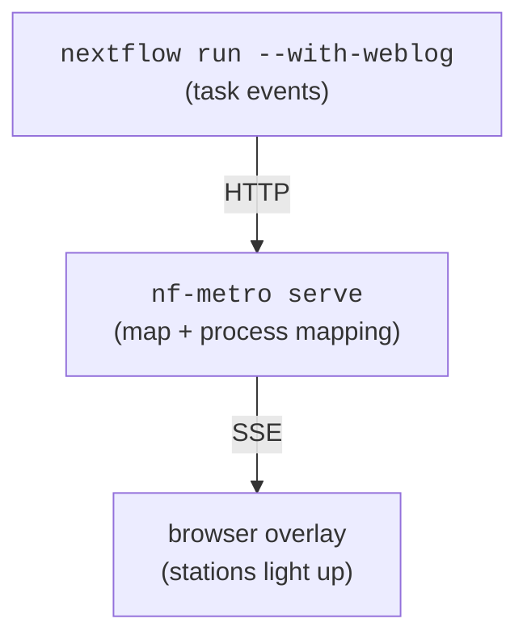

import { Steps } from "@astrojs/starlight/components";

:::note[Stable since 1.0]
The `%%metro process:` directive, `nf-metro serve` / `nf-metro check-mapping`
commands, and the event/overlay formats are stable as of 1.0 and covered by
semantic versioning.
:::

nf-metro can light up a metro map in real time as a Nextflow pipeline runs.
Stock Nextflow `-with-weblog` posts task events to `nf-metro serve`, which draws
a status overlay on top of the static map. Stations move from pending to queued
to running to done, or to failed, each with a per-sample count. This needs no
Seqera Platform and no plugin.



The layout is computed once and the overlay is drawn on top, so the map never
re-flows as state changes.

<video
  controls
  autoplay
  loop
  muted
  playsinline
  style="width: 100%; max-width: 760px; border-radius: 6px"
  src="../assets/live_demo.mp4"
>
  Your browser can't play the embedded video.
  <a href="../assets/live_demo.mp4">Download it here</a>.
</video>

_A pipeline run lighting up the map in real time._

## 1. Map stations to processes

A metro station is a curated abstraction that usually stands for several
Nextflow processes, often a whole subworkflow, so the mapping is many-to-one.
Declare it with `%%metro process:` directives, each pairing a station id with a
regex matched against the **fully-qualified** process name:

```metro
%%metro process: align | NFCORE_RNASEQ:RNASEQ:.*ALIGN.*
%%metro process: qc    | FASTQC
%%metro process: qc    | MULTIQC
```

- The whole field after `|` is one regular expression. There is no comma
  splitting, so quantifiers like `{1,3}` are safe. Repeat the directive to
  attach several patterns to one station.
- A bare name matches a scoped one, so `FASTQC` matches
  `NFCORE_RNASEQ:RNASEQ:FASTQC`.
- Only stations with a `process:` directive change state. Everything else is
  drawn but stays neutral. Plumbing processes such as versions dumps and
  samplesheet checks are usually left unmapped on purpose.
- The mapping is **many-to-one**: a station may represent several processes, but
  a given process should light up **one** station. A process matching the
  patterns of two stations has its progress duplicated on the map, and
  `check-mapping` reports that as a failure. Keep each station's patterns
  specific enough not to overlap, leaning on the scope prefix
  (`NFCORE_RNASEQ:RNASEQ:ALIGN:...`) when a tool recurs.
- The directive is pure metadata and never affects the rendered map.

### Skip the boilerplate with `auto_process`

When a map's station ids already name their processes, as with `star`,
`salmon_quant` and `trimgalore`, a `process:` line per station only restates the
id. Set `%%metro auto_process: true`, or pass `--auto-process`, and each station
with no explicit directive gets its own id as a default pattern, anchored to the
final segment of the process name:

```metro
%%metro auto_process: true
```

`star` then matches `...:STAR_ALIGN`, `salmon_quant` matches `...:SALMON_QUANT`,
and so on. A tool name buried in the scope path, such as
`...:QUANTIFY_STAR_SALMON:SALMON_QUANT`, does **not** light up the `star`
station. That leaves explicit `process:` lines for two exceptions:

- **Abstraction stations** whose id is not a process name, such as `fastqc_raw`,
  `fastqc_trimmed` and `multiqc_final`. The default matches nothing, so they
  stay dark until you map them.
- **One process under several scopes.** If the same process name runs in two
  subworkflows that the map draws as separate stations, such as `salmon_quant`
  for the genome aligner and `salmon_pseudo` for the pseudo-aligner, scope each
  override by its subworkflow so the right station lights up.

Run `check-mapping` after enabling it. A default that matches nothing surfaces
as a dead pattern, pointing you straight at the stations that still need a line.

### Factor out the shared prefix with `process_scope`

The explicit `process:` lines for those exceptions all repeat the pipeline's
fully-qualified prefix (`NFCORE_RNASEQ:RNASEQ:...`) and have to be written as
regexes. Set `%%metro process_scope:`, or pass `--process-scope`, to the shared
prefix. Each `process:` value then becomes the **tail** under that scope, joined
as `<scope>:<tail>` and matched **literally**:

```metro
%%metro process_scope: NFCORE_RNASEQ:RNASEQ
%%metro auto_process: true

%%metro process: fastqc_raw    | FASTQ_FASTQC_UMITOOLS_TRIMGALORE:FASTQC
%%metro process: salmon_quant  | QUANTIFY_STAR_SALMON:SALMON_QUANT
%%metro process: salmon_pseudo | QUANTIFY_PSEUDO_ALIGNMENT:SALMON_QUANT
```

- The prefix lives in one place, so the per-station lines carry only what
  distinguishes them.
- Values are matched **literally** under a scope, so a `.` is a dot rather than
  a wildcard and a pasted process path works with no regex to get wrong.
- Dropping the scope, along with the explicit lines, falls back to
  `auto_process` leaf matching. That ignores the path entirely and so survives a
  subworkflow renesting. Keep the explicit scoped lines where you need
  precision instead.

Without a `process_scope`, `process:` values stay regexes such as
`NFCORE_RNASEQ:RNASEQ:.*ALIGN.*`, unchanged.

## The embedded data manifest

`nf-metro serve` can light up a map because it holds the in-memory graph, so it
knows each station's coordinates and the `process:` mapping. A tool that has
only the **committed SVG file**, with no Python and no graph, needs that
information carried inside the file. Every rendered SVG therefore embeds a
machine-readable manifest: a JSON block in a `<metadata id="diagram-manifest">`
element, plus `data-node-*` attributes on each station's `<g>`. An overlay can
then be positioned, stations restyled and process mappings looked up with no
re-render.

The manifest format is tool-neutral: a station is a _node_, a line a _group_ and
a section a _region_. Its schema, matching semantics and reader and matcher
tooling form a standalone contract documented on the
[Data manifest](/nf-metro/manifest/) page, and any non-metro tool can emit the
same standard. Set `%%metro manifest: false` to emit the drawn map only, with no
manifest, no `data-node-*` attributes and no station-group wrapper.

The manifest is only the static half of the contract. The **runtime state** that
drives the overlay covers the `pending`/`queued`/`running`/`done`/`failed` enum,
the `done`/`total` counts, and the snapshot JSON shape that `GET /state` and
`/stream` serve below. All of it is specified normatively, with its own JSON
Schema, in [Data manifest → Drive a live
overlay](/nf-metro/manifest/#drive-a-live-overlay-the-state-snapshot).
Everything below that point on this page, meaning the weblog receiver, `serve`
and the Nextflow plugin, is **one binding** of that vocabulary to Nextflow. A
host that already has its own authoritative task state needs only the manifest
and the state schema, not this server.

`serve` is one ready-made consumer of the manifest and one reference
producer of the state snapshot. To drive the overlay from your **own**
application instead, see the [Embedding guide](/nf-metro/embedding/).

## 2. Serve the map

`serve` hosts **one** map at a stable URL. Each run's `started` event resets it,
which makes it the mode for iterating on a single pipeline: re-run and watch the
same page. It is also the server the plugin's managed mode spawns. For many
pipelines or runs side by side, use the dashboard in §2b instead.

`serve` accepts two input formats:

- **`.mmd`**, the source file. `serve` renders and lays out the map on startup.
  Use this during map development, since changing the file and restarting shows
  the update immediately.
- **`.svg`**, a pre-rendered SVG with its embedded manifest, which is the default
  output of `nf-metro render`. `serve` reads station geometry and the process
  mapping straight from the manifest, with no re-render and no Python graph. Use
  this when you have committed the SVG to a repo and want to serve it without
  the source, or when you want the layout to stay stable across restarts
  whatever the tool version. The `--theme` option has no effect here, because
  the SVG is already drawn.

:::tip[SVG must carry a manifest]
The SVG path requires the manifest embedded in the file. `nf-metro render`
embeds it by default. If the map opted out with `%%metro manifest: false`,
drop that directive and re-render before serving.
:::

### One-liner (recommended)

Pass the Nextflow command after `--` and `serve` handles everything. It wires
`-with-weblog` automatically, opens your browser, and shuts itself down when the
run finishes.

```bash
# from a source file
nf-metro serve path/to/map.mmd --open --shutdown-after-complete -- \
    nextflow run my/pipeline

# from a pre-rendered SVG
nf-metro serve path/to/map.svg --open --shutdown-after-complete -- \
    nextflow run my/pipeline
```

### Two-shell alternative

To keep the server and the pipeline in separate terminals, which helps when
iterating across many re-runs with the server left running:

```bash
# shell 1 - the live server (either input format works)
nf-metro serve path/to/map.mmd --port 8080
# open http://localhost:8080/

# shell 2 - the pipeline
nextflow run my/pipeline -with-weblog http://localhost:8080/events
```

Stations light up as tasks are submitted, run and complete. A browser that
connects mid-run receives the current state immediately, so you never see a
blank map.

| Option                      | Meaning                                                                                                                              |
| --------------------------- | ------------------------------------------------------------------------------------------------------------------------------------ |
| `--port`                    | Port to listen on (default 8080).                                                                                                    |
| `--host`                    | Interface to bind. Default `127.0.0.1` (local only); use `0.0.0.0` to accept connections from other hosts.                           |
| `--theme`                   | Theme name (`nfcore`, `light`, `seqera`). The page chrome (background, text) follows the theme, so a light theme gives a light page. |
| `--overlay`                 | Status-overlay style: `ring` (default), `pulse`, `dot`, or `led`. Sets the style shown until a viewer picks another.                 |
| `--open`                    | Open the live page in the default browser when the server starts.                                                                    |
| `--shutdown-after-complete` | Stop the server shortly after the run's `completed` or `error` event (or after the launched command exits).                          |
| `--shutdown-grace`          | Seconds to keep the map up after the run finishes before shutting down (used with `--shutdown-after-complete`; default 5).           |
| `--token`                   | If set, `/events` POSTs must supply `?token=...` or an `X-Metro-Token` header.                                                       |

### Overlay styles

The status overlay shows whether a station is pending, queued, running, done or
failed. It comes in four looks, picked in the page's **Style** menu, where the
choice is remembered per browser, or set as the page default with `--overlay`.
Every mark takes the station's own marker shape: a circle for a single-line
stop, and a capsule spanning the bundle for an interchange.

- **`ring`** is the default. A bold outline hugs each station, leaving the marker
  visible underneath, and the dash marches around it while running. It is the
  cleanest of the four and the recommended look for a light page or for
  embedding in Seqera Platform.
- **`pulse`** fills the station with a crisp status mark and adds a radar ripple
  while running.
- **`dot`** is a flat status mark that gently breathes while running, with no
  glow. It is the most minimal option.
- **`led`** draws glowing neon marks that pulse while running. It reads best on
  the dark `nfcore` theme.

Every style is driven client-side from the same status data, so switching style
never re-renders the map. Animations respect `prefers-reduced-motion`.

### Endpoints

| Path           | Purpose                                                                                    |
| -------------- | ------------------------------------------------------------------------------------------ |
| `GET /`        | The live page (static SVG + status overlay).                                               |
| `GET /stream`  | Server-sent events; the page subscribes to this. Each event's `data:` is a state snapshot. |
| `GET /state`   | Current state snapshot as JSON (handy for scripting/debugging).                            |
| `POST /events` | Nextflow weblog receiver.                                                                  |

`/state` and each `/stream` message share one JSON shape, the [state
snapshot](/nf-metro/manifest/#drive-a-live-overlay-the-state-snapshot), which
`nf_metro.live.state_schema()` can validate.

## 2b. Persistent server (many runs)

`serve` reuses one map across re-runs and resets it each time. `serve-multi` is
a long-lived **dashboard** instead: each registered run gets its own `/r/<id>/`
entry, so many pipelines, or a history of runs, sit side by side. It starts with
**no** map. A pipeline registers its map by POSTing the `.mmd` to `/maps`, then
sends weblog events to the run's own endpoint:

```bash
nf-metro serve-multi --port 8080        # index at http://localhost:8080/

# a pipeline registers its map (returns {"id","view","events"})
curl -s --data-binary @map.mmd "http://localhost:8080/maps?name=myrun"
# then POST weblog events to the returned /r/<id>/events
```

`GET /` lists every run with a live status, and `GET /r/<id>/` is that run's live
map. The endpoints mirror the single-map server under a `/r/<id>/` prefix:
`/r/<id>/`, `/r/<id>/state`, `/r/<id>/stream` and `POST /r/<id>/events`.
`POST /maps` registers a run.

### Demo: a shared dashboard

<Steps>

1. Start the dashboard server:

   ```bash
   nf-metro serve-multi --port 8080            # dashboard at http://localhost:8080/
   ```

2. Register each pipeline's map and capture the run id:

   ```bash
   # register the map (prints JSON with "id" and "events" fields)
   RUN=$(curl -s --data-binary @assets/metro_map.mmd \
         "http://localhost:8080/maps?name=myrun")
   RUN_ID=$(echo "$RUN" | python3 -c "import sys,json; print(json.load(sys.stdin)['id'])")
   ```

3. Start Nextflow pointing at that run's events endpoint:

   ```bash
   nextflow run my/pipeline \
     -with-weblog "http://localhost:8080/r/${RUN_ID}/events"
   ```

</Steps>

Repeat for as many pipelines as you like. Open `http://localhost:8080/` to watch
every run light up on one page. The server stays up across runs.

## 2c. The Nextflow plugin (optional)

Everything in §2 and §2b works with **no plugin**. Nextflow's built-in
`-with-weblog` posts events to a running server, and the persistent dashboard is
driven by a `curl` to `/maps` plus a per-run `-with-weblog` URL. The
[nf-metro Nextflow plugin](https://github.com/seqeralabs/nf-metro-plugin) is a
convenience layer on top: it emits the same events, but from config and with the
plumbing handled for you. The Python tooling here never depends on it.

### Installing the plugin

:::caution[Not yet on the Nextflow plugin registry]
The plugin is not yet published to the Nextflow plugin registry, so the
normal `plugins { id 'nf-metro@0.1.0' }` auto-download does not work yet.
Build and install it locally first:

```bash
git clone https://github.com/seqeralabs/nf-metro-plugin
cd nf-metro-plugin
make install        # installs to ~/.nextflow/plugins
```

This requires Java 17+ and Nextflow 25.10.0+. Once installed, the `plugins {}`
block in the config examples below will find it.

You can also run against the build tree without installing. Build first, then
set `NXF_PLUGINS_DEV`, and pass `-plugins` on the command line:

```bash
git clone https://github.com/seqeralabs/nf-metro-plugin
cd nf-metro-plugin
make assemble       # build but do not install
# then, from anywhere:
NXF_PLUGINS_DEV=/path/to/nf-metro-plugin \
  nextflow run my/pipeline -plugins nf-metro@0.1.0
```

:::

### Plugin demo: shared dashboard

The plugin's `metro.server` mode does the register-and-emit automatically, so a
plain `nextflow run` shows up on the dashboard:

Start one persistent server:

```bash
nf-metro serve-multi --port 8080            # dashboard at http://localhost:8080/
```

Point any pipeline at it via the plugin's `metro` config (in `nextflow.config`
or a `-c` overlay), then run it normally:

```groovy
plugins { id 'nf-metro@0.1.0' }
metro {
    server = 'http://localhost:8080'
    map    = 'assets/metro_map.mmd'
}
```

```bash
nextflow run my/pipeline      # repeat for as many pipelines as you like
```

Each run prints `registered on ...; live map: http://localhost:8080/r/<id>/`.
Open `http://localhost:8080/` to watch every run light up on one page. The
server stays up across runs.

| Task             | Without the plugin                                                                        | With the plugin                                                                 |
| ---------------- | ----------------------------------------------------------------------------------------- | ------------------------------------------------------------------------------- |
| Wiring           | `-with-weblog <url>` on every run                                                         | One `plugins { id 'nf-metro' }` + a `metro {}` block in `nextflow.config`       |
| Run the server   | Start `nf-metro serve` yourself in another shell                                          | **Managed mode** spawns and stops it for the run (and can open the browser)     |
| Shared dashboard | `curl` the map to `/maps`, read the run id, then point `-with-weblog` at `/r/<id>/events` | **Central mode** registers the map and wires the per-run endpoint automatically |
| Find the map     | -                                                                                         | Prints the live URL in the run log                                              |

The standalone path is fine for a quick look. The plugin earns its place when
you want the integration to live in the pipeline's config, want the server
started and stopped for you, or want runs to self-register on a shared
dashboard, since the register-then-emit step is awkward to do by hand. The
plugin has three modes, attach, managed and central, documented in its
[README](https://github.com/seqeralabs/nf-metro-plugin#three-modes).

:::note[Managed mode requires `nf-metro` on PATH]
Managed mode spawns `nf-metro serve` as a subprocess, so the `nf-metro`
command must be on the PATH when Nextflow runs. If it is not found the
plugin logs a warning and the pipeline continues without the live map.
Use `metro.binary = '/absolute/path/to/nf-metro'` in the config to point
to a specific installation.
:::

## 3. Keep the mapping honest

Any mapping can drift in three ways: a new process the map can't show, which
disappears silently; a station pattern that matches nothing, which goes stale;
and a process whose patterns match more than one station, which duplicates its
progress. `check-mapping` makes all three loud so CI can gate on them:

```bash
# Export the pipeline's process graph, then lint the map against it
nextflow run my/pipeline -with-dag dag.mmd -preview
nf-metro check-mapping path/to/map.mmd --dag dag.mmd
```

```text
Processes with no station (invisible): 1
  - BWA_MEM
Station patterns matching no process (stale): 1
  - align: NFCORE_RNASEQ:RNASEQ:OLD_ALIGNER
Processes matching more than one station (duplicates progress): 1
  - FASTQC: align, qc
```

It exits non-zero when it finds drift. Options:

| Option               | Meaning                                                                                                         |
| -------------------- | --------------------------------------------------------------------------------------------------------------- |
| `--dag <file>`       | A `nextflow -with-dag` Mermaid export; process names are read from its stadium nodes.                           |
| `--processes <file>` | A newline-delimited list of process names (e.g. captured from a run) - an authoritative alternative to `--dag`. |
| `--ignore <regex>`   | Processes deliberately left unmapped (plumbing such as `.*:DUMPSOFTWAREVERSIONS`). Repeatable.                  |

Stations with no mapping at all never light up. They are reported as a note
rather than a failure, because leaving one unmapped is often deliberate.

## Deployment notes

- **Reachability.** For HPC and cloud runs the weblog POSTs come from wherever
  Nextflow executes, not from your laptop. Run the server somewhere reachable
  from there, such as the head node, or tunnel with
  `ssh -L 8080:localhost:8080 headnode` and point the run at
  `http://localhost:8080/events`.
- **Security.** `/events` is unauthenticated by default and the server binds
  `127.0.0.1`. When binding a non-local interface with `--host 0.0.0.0`, set
  `--token` so only your run can post events. Send the token as the
  `X-Metro-Token` header or a `?token=` query parameter. Prefer the header where
  you can, because a URL carrying the token lands in shell history and process
  listings.
- **Run lifecycle.** A `started` event resets the map, so re-running a pipeline
  re-animates a fresh one. The server tracks one run at a time. Unrecognised or
  malformed event payloads are accepted and ignored, and the endpoint always
  returns 200, so a Nextflow version emitting extra event types can't stall a
  run.
- **No denominator.** Nextflow's task count is dynamic, so the per-station count
  reads "done / submitted so far" rather than a fixed percentage.

## Run the bundled demo

The repository ships a self-contained demo under
[`examples/live/`](https://github.com/seqeralabs/nf-metro/tree/main/examples/live):
a toy workflow whose processes only `sleep`, a map with the processes mapped,
and a process list for `check-mapping`. From the repo root:

```bash
nf-metro serve examples/live/pipeline.mmd --open --shutdown-after-complete -- \
    nextflow run examples/live/workflow/main.nf \
              -c examples/live/workflow/nextflow.config
```

Three coloured lines fan out after Trim Galore, run in parallel, then converge
at MultiQC. The browser opens automatically, and the server stops when the
pipeline finishes.
