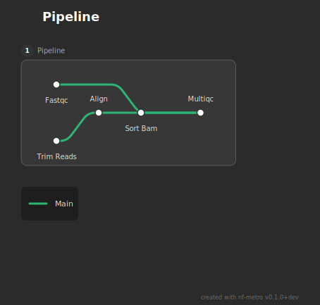
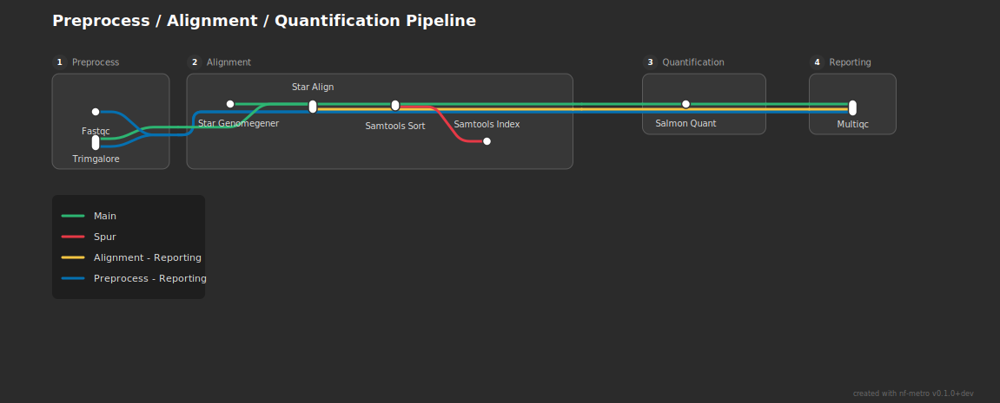
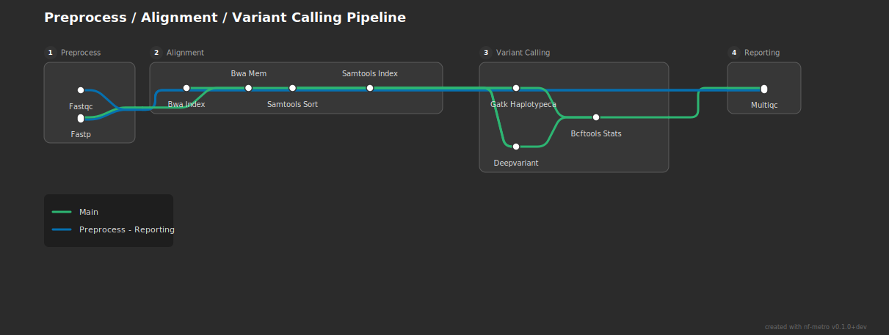

# Importing from Nextflow

nf-metro can convert Nextflow's built-in DAG output into a metro map. This works best for simple pipelines with a handful of subworkflows. For complex pipelines like those in nf-core, direct conversion is unlikely to produce a good diagram -- you will need to hand-write or heavily edit the `.mmd` file. Improving this is an active area of development.

## Getting started

Nextflow can export its pipeline DAG in mermaid format:

```bash
nextflow run my_pipeline.nf -preview -with-dag dag.mmd
```

The `-preview` flag skips execution and just generates the DAG. The resulting file uses Nextflow's `flowchart TB` mermaid syntax, which nf-metro cannot render directly but can convert.

The recommended workflow is to convert first, then review and optionally edit before rendering:

```bash
# Convert Nextflow DAG to nf-metro format
nf-metro convert dag.mmd -o pipeline.mmd --title "My Pipeline"

# Review the .mmd file, then render
nf-metro render pipeline.mmd -o pipeline.svg
```

For simple pipelines where hand-tuning is not needed, you can convert and render in one step:

```bash
nf-metro render dag.mmd -o pipeline.svg --from-nextflow --title "My Pipeline"
```

## Examples

The following examples use simple Nextflow pipelines to show what the converter produces. Each starts from a real `nextflow -with-dag` output.

### 1. Flat pipeline (no subworkflows)

A linear pipeline with five processes and no subworkflows:

```groovy
workflow {
    FASTQC(reads_ch)
    TRIM_READS(reads_ch)
    ALIGN(TRIM_READS.out, reference_ch.collect())
    SORT_BAM(ALIGN.out)
    MULTIQC(FASTQC.out.zip.mix(SORT_BAM.out.map { it[1] }).collect())
}
```

Nextflow produces this DAG (`nextflow run flat_pipeline.nf -preview -with-dag dag.mmd`):

```text
flowchart TB
    subgraph " "
    v0["Channel.of"]
    v1["Channel.of"]
    end
    v2(["FASTQC"])
    v4(["TRIM_READS"])
    v6(["ALIGN"])
    v7(["SORT_BAM"])
    v11(["MULTIQC"])
    v5(( ))
    v8(( ))
    v0 --> v2
    v0 --> v4
    v1 --> v5
    v4 --> v6
    v5 --> v6
    v6 --> v7
    v7 --> v8
    v2 --> v8
    v8 --> v11
```

The channel nodes (`v0`, `v1`), value nodes, and operator nodes (`v5`, `v8`) are Nextflow internals. The converter strips these and keeps only the process nodes, reconnecting edges through the removed nodes.

Running `nf-metro convert dag.mmd -o pipeline.mmd` produces:

```text
%%metro title: Pipeline
%%metro style: dark
%%metro line: main | Main | #2db572

graph LR
    subgraph pipeline [Pipeline]
        fastqc([Fastqc])
        trim_reads([Trim Reads])
        align([Align])
        sort_bam([Sort Bam])
        multiqc([Multiqc])

        fastqc -->|main| multiqc
        trim_reads -->|main| align
        align -->|main| sort_bam
        sort_bam -->|main| multiqc
    end
```



With no subworkflows, everything lands in a single section. The converter assigns a single "main" line following the longest path.

### 2. Pipeline with subworkflows

Adding subworkflows gives the converter structure to work with. This pipeline has three subworkflows (Preprocess, Alignment, Quantification) plus a standalone MultiQC process:

```groovy
workflow PREPROCESS {
    FASTQC(reads)
    TRIMGALORE(reads)
}

workflow ALIGNMENT {
    STAR_GENOMEGENERATE(genome, gtf)
    STAR_ALIGN(reads, STAR_GENOMEGENERATE.out.index.collect())
    SAMTOOLS_SORT(STAR_ALIGN.out.bam)
    SAMTOOLS_INDEX(SAMTOOLS_SORT.out.bam)
}

workflow QUANTIFICATION {
    SALMON_QUANT(bam, gtf)
}

workflow {
    PREPROCESS(reads_ch)
    ALIGNMENT(PREPROCESS.out.reads, genome_ch, gtf_ch)
    QUANTIFICATION(ALIGNMENT.out.bam, gtf_ch)
    MULTIQC(/* all logs */)
}
```

The converter maps each subworkflow to a section and auto-creates a "Reporting" section for the standalone MultiQC. It also detects bypass lines (edges that skip sections, like QC metrics going from Preprocess directly to Reporting) and spur lines (dead-end processes like Samtools Index that branch off the main flow):

```text
%%metro title: Preprocess / Alignment / Quantification Pipeline
%%metro style: dark
%%metro line: main | Main | #2db572
%%metro line: spur | Spur | #e63946
%%metro line: alignment_reporting | Alignment - Reporting | #f5c542
%%metro line: preprocess_reporting | Preprocess - Reporting | #0570b0

graph LR
    subgraph preprocess [Preprocess]
        fastqc([Fastqc])
        trimgalore([Trimgalore])
    end

    subgraph alignment [Alignment]
        star_genomegenerate([Star Genomegener])
        star_align([Star Align])
        samtools_sort([Samtools Sort])
        samtools_index([Samtools Index])

        star_genomegenerate -->|main| star_align
        star_align -->|main| samtools_sort
        samtools_sort -->|spur| samtools_index
    end

    subgraph quantification [Quantification]
        salmon_quant([Salmon Quant])
    end

    subgraph reporting [Reporting]
        multiqc([Multiqc])
    end

    %% Inter-section edges
    trimgalore -->|main| star_align
    samtools_sort -->|main| salmon_quant
    salmon_quant -->|main| multiqc
    fastqc -->|preprocess_reporting| multiqc
    trimgalore -->|preprocess_reporting| multiqc
    star_align -->|alignment_reporting| multiqc
```



This is where the limits start to show. The bypass lines (blue and yellow) route through intermediate sections rather than around them, and the layout gets busy. For a pipeline this size, hand-editing the converted `.mmd` is recommended.

### 3. Diamond pattern (two variant callers)

This pipeline has a diamond pattern where two variant callers (GATK and DeepVariant) both receive input from the same alignment step and both feed into BCFtools Stats:

```groovy
workflow VARIANT_CALLING {
    GATK_HAPLOTYPECALLER(bam_bai, genome_ch)
    DEEPVARIANT(bam_bai, genome_ch)
    BCFTOOLS_STATS(
        GATK_HAPLOTYPECALLER.out.vcf.mix(DEEPVARIANT.out.vcf)
    )
}
```

The converter handles the diamond cleanly:

```text
%%metro title: Preprocess / Alignment / Variant Calling Pipeline
%%metro style: dark
%%metro line: main | Main | #2db572
%%metro line: preprocess_reporting | Preprocess - Reporting | #0570b0

graph LR
    subgraph variant_calling [Variant Calling]
        gatk_haplotypecaller([Gatk Haplotypeca])
        deepvariant([Deepvariant])
        bcftools_stats([Bcftools Stats])

        gatk_haplotypecaller -->|main| bcftools_stats
        deepvariant -->|main| bcftools_stats
    end

    %% Inter-section edges
    samtools_sort -->|main| gatk_haplotypecaller
    samtools_sort -->|main| deepvariant
    samtools_index -->|main| gatk_haplotypecaller
    samtools_index -->|main| deepvariant
```



The fan-out from Alignment to the two callers and fan-in to BCFtools Stats renders well. The QC bypass line from Preprocess to Reporting is the same known limitation as example 2.

## Hand-tuning the output

The converted `.mmd` file is plain text. Common edits:

- Rename lines or change their colors (`%%metro line:` directives)
- Rename sections (the `subgraph` display names)
- Add entry/exit port hints to control line routing at section boundaries
- Remove or merge sections to simplify the layout
- Add `%%metro grid:` directives to override section placement

See the [Guide](guide.md) for the full `.mmd` format reference.

## How the converter works

The converter strips Nextflow's channel and operator nodes (keeping only processes), reconnects edges through the removed nodes, maps subworkflows to sections, and assigns colored metro lines based on the graph structure. Process names are cleaned up from `SCREAMING_SNAKE_CASE` to `Title Case` and long names are abbreviated.
